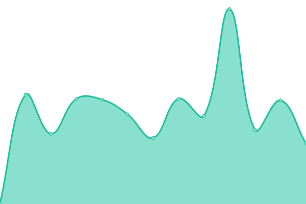
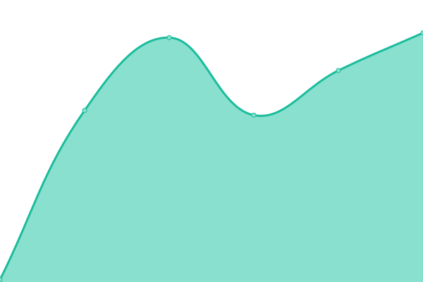
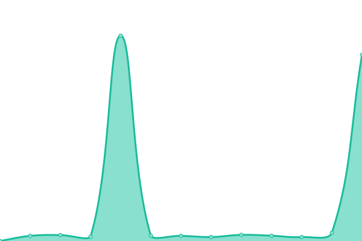
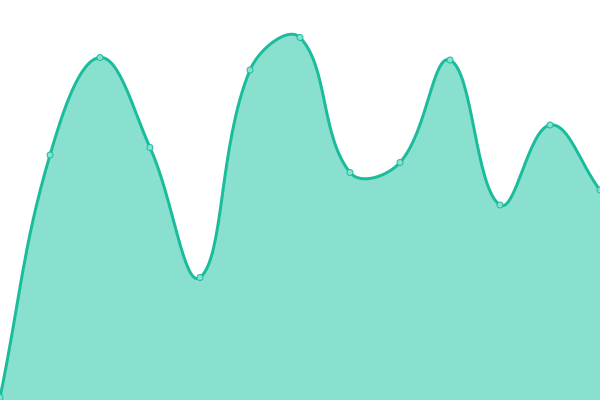

# [📈 Live Status](https://excalidraw.github.io/upptime): <!--live status--> **🟩 All systems operational**

This repository contains the open-source uptime monitor and status page for [Excalidraw](https://excalidraw.com), powered by [Upptime](https://github.com/upptime/upptime).

With [Upptime](https://upptime.js.org), you can get your own unlimited and free uptime monitor and status page, powered entirely by a GitHub repository. We use [Issues](https://github.com/excalidraw/upptime/issues) as incident reports, [Actions](https://github.com/excalidraw/upptime/actions) as uptime monitors, and [Pages](https://excalidraw.github.io/upptime) for the status page.

<!--start: status pages-->
<!-- This summary is generated by Upptime (https://github.com/upptime/upptime) -->
<!-- Do not edit this manually, your changes will be overwritten -->
<!-- prettier-ignore -->
| URL | Status | History | Response Time | Uptime |
| --- | ------ | ------- | ------------- | ------ |
|  [Excalidraw](https://excalidraw.com) | 🟩 Up | [excalidraw.yml](https://github.com/excalidraw/upptime/commits/master/history/excalidraw.yml) | 

 120ms
     
 | 

<a href="https://status.excalidraw.com/history/excalidraw">100.00%</a>
    

|  [Excalidraw Collaboration](https://portal.excalidraw.com) | 🟩 Up | [excalidraw-collaboration.yml](https://github.com/excalidraw/upptime/commits/master/history/excalidraw-collaboration.yml) | 

 89ms
     
 | 

<a href="https://status.excalidraw.com/history/excalidraw-collaboration">99.77%</a>
    

|  [Excalidraw Storage](https://json.excalidraw.com) | 🟩 Up | [excalidraw-storage.yml](https://github.com/excalidraw/upptime/commits/master/history/excalidraw-storage.yml) | 

 923ms
     
 | 

<a href="https://status.excalidraw.com/history/excalidraw-storage">100.00%</a>
    

|  [Excalidraw Libraries](https://libraries.excalidraw.com) | 🟩 Up | [excalidraw-libraries.yml](https://github.com/excalidraw/upptime/commits/master/history/excalidraw-libraries.yml) | 

 105ms
     
 | 

<a href="https://status.excalidraw.com/history/excalidraw-libraries">100.00%</a>
    

|  [Excalidraw Blog](https://blog.excalidraw.com) | 🟩 Up | [excalidraw-blog.yml](https://github.com/excalidraw/upptime/commits/master/history/excalidraw-blog.yml) | 

 79ms
     
 | 

<a href="https://status.excalidraw.com/history/excalidraw-blog">100.00%</a>
    

<!--end: status pages-->

[**Visit our status website →**](https://excalidraw.github.io/upptime)

## 📄 License

- Powered by: [Upptime](https://github.com/upptime/upptime)
- Code: [MIT](./LICENSE) © [Excalidraw](https://excalidraw.com)
- Data in the `./history` directory: [Open Database License](https://opendatacommons.org/licenses/odbl/1-0/)
